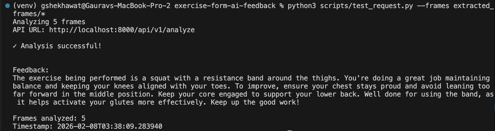

# Exercise Form Feedback API

An LLM-based exercise form feedback system that analyzes exercise videos using computer vision and provides personalized coaching feedback.

## Features

- **Video Analysis**: Upload exercise videos (5-30 seconds, MP4/MOV/AVI format)
- **Frame Extraction**: Automatically extracts 5 key frames at strategic positions (0%, 25%, 50%, 75%, 100%)
- **AI-Powered Feedback**: Uses OpenAI GPT-4o Vision API to detect exercises and provide form feedback
- **Dual Input Methods**: Supports both video file upload and pre-extracted base64-encoded frames
- **RESTful API**: Built with FastAPI for high performance and automatic documentation

## What This System Does

1. Accepts exercise videos or pre-extracted frames
2. Extracts representative frames from videos
3. Sends frames to OpenAI's GPT-4o Vision model
4. LLM automatically detects the exercise type
5. Returns personalized form feedback with detected exercise and metadata

## Prerequisites

- **Python 3.9 or higher**
- **OpenAI API key** (with GPT-4o access)

## Installation

### 1. Clone the repository

```bash
git clone git@github.com:gshekhawat0820/exercise-form-ai-feedback.git
cd exercise-form-ai-feedback
```

### 2. Create a virtual environment

```bash
python3 -m venv venv
```

### 3. Activate virtual environment

**On macOS/Linux:**
```bash
source venv/bin/activate
```

**On Windows:**
```bash
venv\Scripts\activate
```

### 4. Install dependencies

```bash
pip install -r requirements.txt
```

### 5. Configure environment variables

```bash
cp .env.example .env
```

Edit `.env` and add your OpenAI API key:

```bash
OPENAI_API_KEY=sk-your-actual-api-key-here
```

## Configuration

Environment variables in `.env`:

| Variable | Description | Default |
|----------|-------------|---------|
| `OPENAI_API_KEY` | OpenAI API key | Required |
| `MODEL_NAME` | OpenAI model to use | `gpt-4o` |
| `MAX_VIDEO_SIZE_MB` | Maximum video file size | `50` |
| `MAX_VIDEO_DURATION_SEC` | Maximum video duration | `30` |
| `MIN_VIDEO_DURATION_SEC` | Minimum video duration | `5` |
| `FRAME_COUNT` | Number of frames to extract | `5` |
| `LOG_LEVEL` | Logging level | `INFO` |

## Running the Server

Start the development server:

```bash
uvicorn app.main:app --reload --port 8000
```

The API will be available at `http://localhost:8000`

## API Documentation

Once the server is running, visit:
- **Swagger UI**: http://localhost:8000/docs
- **ReDoc**: http://localhost:8000/redoc

### Endpoints

#### Health Check
```http
GET /health
```

**Response:**
```json
{
  "status": "healthy"
}
```

#### Analyze Exercise Video
```http
POST /api/v1/analyze
```

**Success Response (200 OK):**
```json
{
  "feedback": "I can see you're performing a squat. You're doing a good job keeping your chest up and maintaining balance throughout the movement. One thing to focus on is your knee alignment...",
  "frames_analyzed": 5,
  "timestamp": "2026-02-07T15:30:00Z"
}
```

**Error Responses:**
- `413 Payload Too Large` - File exceeds size/duration limits
- `422 Unprocessable Entity` - Invalid file format or processing failure
- `429 Too Many Requests` - API rate limit exceeded
- `500 Internal Server Error` - Server error
- `503 Service Unavailable` - LLM API unavailable

## Usage Examples

### Using the test_request Script (Recommended)

The easiest way to test the API is using the included `test_request.py` script:

```bash
# Analyze a video file
python3 scripts/test_request.py --video path/to/your_video.mp4

# Analyze pre-extracted frames
python3 scripts/test_request.py --frames frame1.jpg frame2.jpg frame3.jpg frame4.jpg frame5.jpg

# Extract frames first, then analyze
python3 scripts/extract_frames.py my_video.mp4
python3 scripts/test_request.py --frames extracted_frames/*.jpg
```

### cURL

```bash
# Analyze a video file
curl -X POST http://localhost:8000/api/v1/analyze \
  -F "video=@squat_video.mp4" \
  | jq
```

## Example Output

Here is example output after running the program on extracted frames from a video:



The script analyzes 5 frames and returns personalized feedback about the exercise form, including specific tips for improvement.

## Testing

Run the test suite:

```bash
# Run all tests
pytest tests/ -v

# Run with coverage report
pytest tests/ -v --cov=app --cov-report=html

# View coverage report
open htmlcov/index.html
```

## Utility Scripts

The project includes helper scripts in the `scripts/` directory:

### test_request.py
CLI tool for testing the API with videos or frames. The server must be running at `http://localhost:8000`.

```bash
# Test with a video file
python3 scripts/test_request.py --video my_squat.mp4

# Test with pre-extracted frames
python3 scripts/test_request.py --frames frame1.jpg frame2.jpg frame3.jpg
```

### extract_frames.py
Extract frames from a video file for testing or inspection.

```bash
python3 scripts/extract_frames.py path/to/video.mp4
```

This creates an `extracted_frames/` directory with 5 frames from the video at key positions (0%, 25%, 50%, 75%, ~98%).

## Performance & Cost

### Expected Performance
- **Frame extraction time**: 1-3 seconds (depends on video length and format)
- **LLM API call time**: 2-5 seconds (includes retry logic with exponential backoff)
- **Total request time**: 3-8 seconds

### Estimated Costs (OpenAI GPT-4o)
**Pricing:**
- Input: $2.50 per 1M tokens
- Output: $10.00 per 1M tokens

**Per Request Estimate:**
- **Input tokens**: ~2,700-4,200 tokens (5 images @ ~500-800 tokens each + ~200 token prompt)
- **Output tokens**: ~100-300 tokens (feedback text)
- **Approximate cost**: $0.008-0.015 USD per request (~$0.01 average)

**Cost Breakdown Example:**
- 100 requests/day × $0.01 = $1.00/day
- 1,000 requests/month × $0.01 = $10.00/month

*Note: Costs may vary based on image complexity and response length. Images are resized to max 1024px to optimize costs.*

## Project Structure

```
exercise-form-ai-feedback/
├── .env.example                  # Environment variable template
├── .gitignore                   # Git ignore rules
├── README.md                    # This file
├── KEY_LEARNINGS.md             # Implementation insights and learnings
├── requirements.txt             # Python dependencies
├── app/
│   ├── __init__.py
│   ├── main.py                 # FastAPI application entry point
│   ├── api/
│   │   ├── __init__.py
│   │   └── routes.py           # API endpoint definitions
│   ├── services/
│   │   ├── __init__.py
│   │   ├── video_processor.py  # Video decoding and frame extraction
│   │   ├── frame_sampler.py    # Frame sampling logic (handles codec edge cases)
│   │   └── llm_analyzer.py     # OpenAI LLM integration with retry logic
│   ├── models/
│   │   ├── __init__.py
│   │   └── schemas.py          # Pydantic request/response models
│   ├── core/
│   │   ├── __init__.py
│   │   ├── config.py           # Application settings and configuration
│   │   └── prompts.py          # LLM prompt templates
│   └── utils/
│       ├── __init__.py
│       └── validators.py       # Input validation utilities
├── tests/
│   ├── __init__.py
│   ├── conftest.py             # Pytest configuration and fixtures
│   ├── test_api.py             # API endpoint tests
│   ├── test_validators.py      # Input validation tests
│   └── fixtures/
│       ├── example_output.png  # Example CLI output screenshot
│       └── *.mp4, *.MOV        # Test video files (gitignored)
└── scripts/
    ├── test_request.py         # CLI tool to test API with videos or frames
    └── extract_frames.py       # Extract frames from videos for testing
```

## Troubleshooting

### Video Format Not Supported
- Ensure video is in MP4, MOV, or AVI format
- Try converting to MP4 H.264 codec (most compatible)

### OpenAI API Rate Limit
- The API includes automatic retry logic with exponential backoff (3 attempts)
- If you still hit rate limits, wait a few minutes before retrying
- Check your OpenAI API tier limits at https://platform.openai.com/account/limits

### NumPy/OpenCV Compatibility Issues
If you see `ImportError: cannot import name 'NDArray' from 'numpy.typing'`:
- Ensure NumPy version is between 1.21.0 and 2.0: `pip install "numpy>=1.21.0,<2.0"`
- This is already specified in `requirements.txt`

### Dependencies Installation Fails
- Ensure Python 3.9+ is installed: `python --version`
- Try upgrading pip: `pip install --upgrade pip`

### Server Won't Start / Import Errors
- Make sure you've activated the virtual environment: `source venv/bin/activate`
- Verify all dependencies are installed: `pip install -r requirements.txt`
- Check that `.env` file exists and contains `OPENAI_API_KEY`

## Development Notes

For detailed implementation insights, edge cases discovered, and lessons learned during development, see [KEY_LEARNINGS.md](KEY_LEARNINGS.md). This document covers:

- Frame extraction edge cases (the 98% cap solution for codec limitations)
- Retry logic implementation for external APIs
- Resource cleanup with finally blocks
- Error message design principles
- AI-assisted development approach and transparency

## Acknowledgments

Built with:
- [FastAPI](https://fastapi.tiangolo.com/)
- [OpenAI GPT-4o](https://openai.com/)
- [OpenCV](https://opencv.org/)
